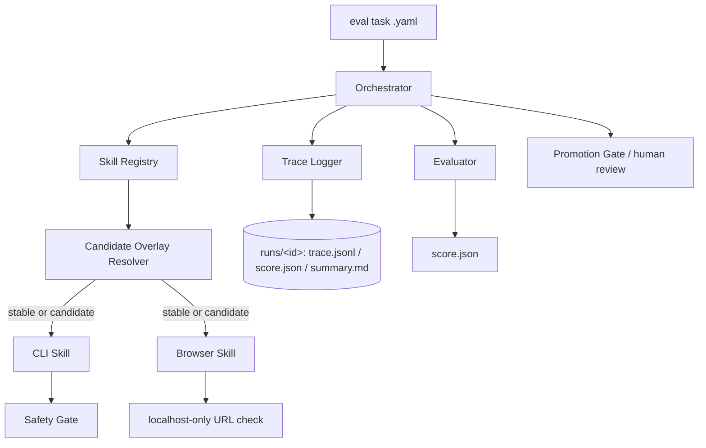
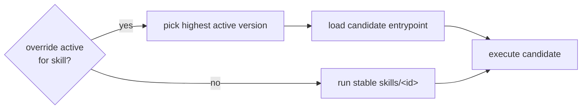
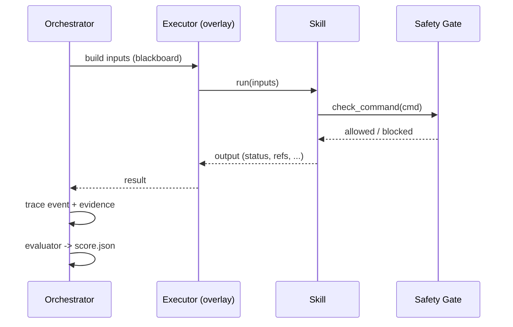
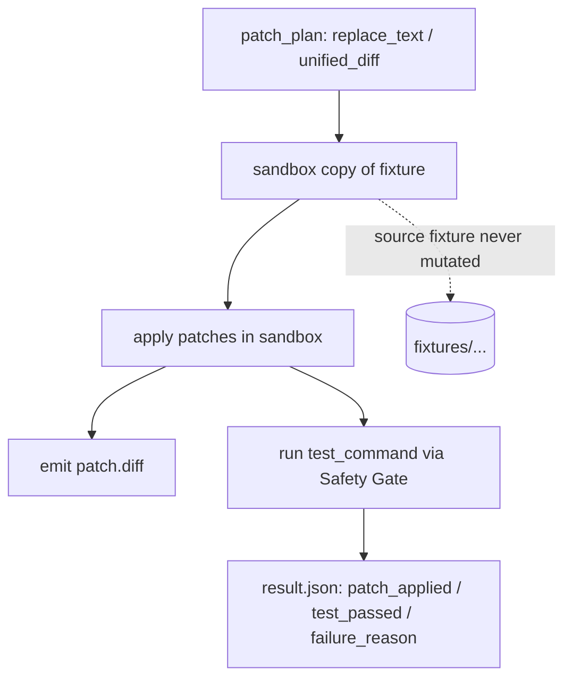
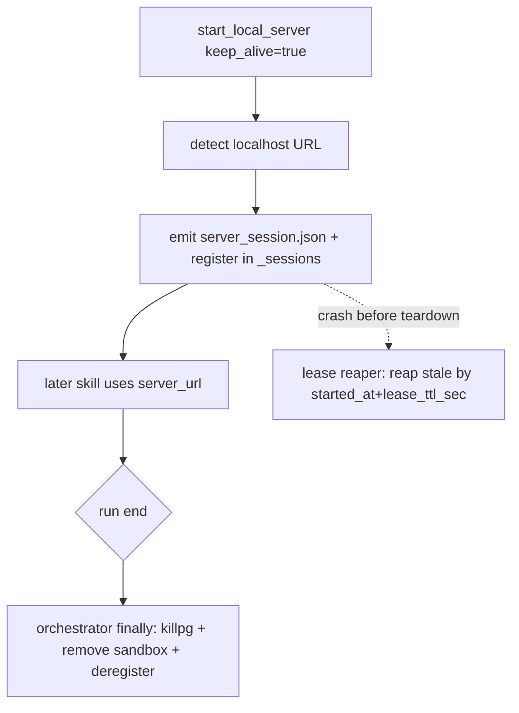
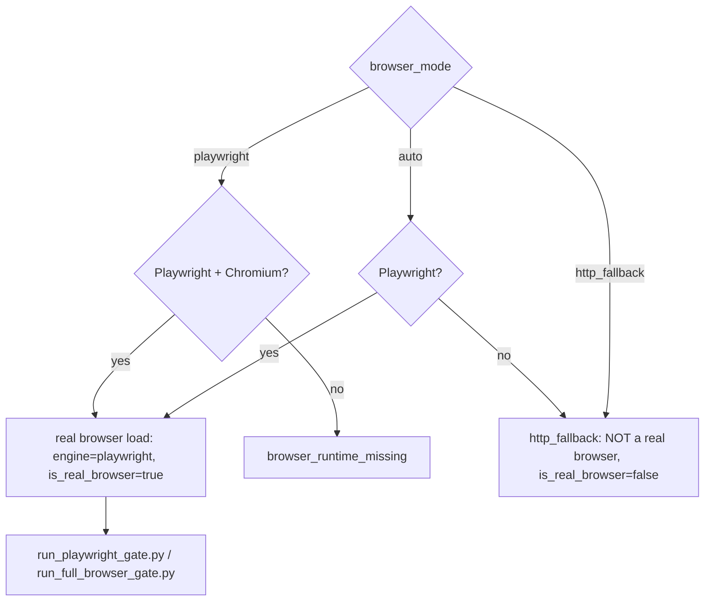
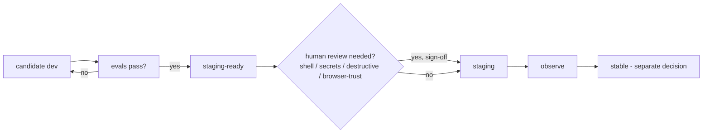

# 06 · Architecture Diagrams

Mermaid diagrams (render on GitHub or any Mermaid viewer). Reuse any of these in
slides.

## Overall Harness Architecture

## Candidate Overlay Flow

## Skill Execution Flow

## Patch Runner Flow (patch_file_and_run_tests_v2)

## Server Keep-Alive Handoff Flow (start_local_server_v1.2)

## Browser Gate Flow

## Promotion Gate Flow

