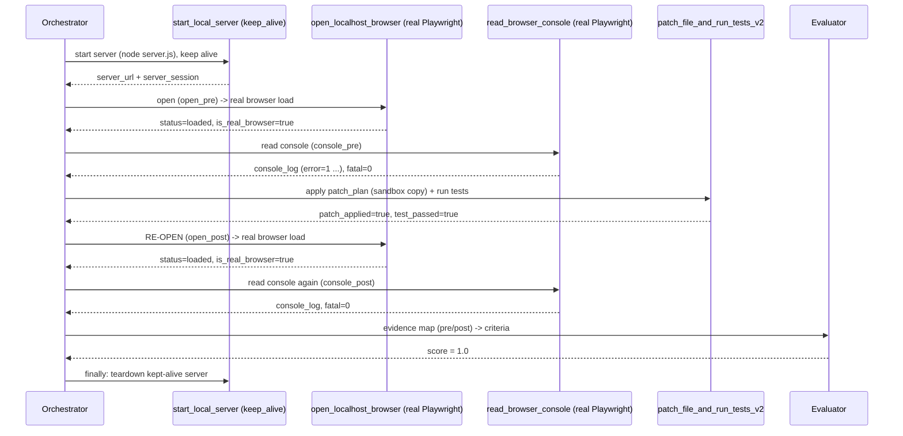

# Architecture Diagram — Full Real-Browser Chain

The full `full_browser_vite_login_bug_e2e` chain (real Playwright browser), with
the orchestrator's evaluator scoring it.

## Sequence

## Flow (criteria mapping)

```mermaid
flowchart TD
    A[start server keep_alive] -->|server_started| B[open browser pre]
    B -->|real_browser_page_loaded| C[collect console pre]
    C -->|console_error_collected| D[patch + run tests]
    D -->|patch_applied / tests_pass| E[re-open browser post]
    E -->|browser_reverify_passed| F[re-collect console post]
    F -->|no_fatal_console_error_after_patch| G[teardown server]
    G -->|no_lingering_server_process| H[Evaluator: score 1.0]
```

## Notes

- `open_pre`/`console_pre` and `open_post`/`console_post` are the same skills run
  twice via aliased required-skills entries (`{skill: X, as: alias}`) — a minimal
  pre/post mechanism, not a generic DAG or planner.
- The patch is applied to a **sandbox copy** (the source fixture is never mutated);
  the served page's `console.error` is a non-fatal symptom, while the source fix is
  verified by `tests_pass`. The post-patch hard guarantee is **fatal = 0**.
- Every browser/console result is tagged `engine=playwright`,
  `is_real_browser=true`. **http_fallback is not a real browser.**
