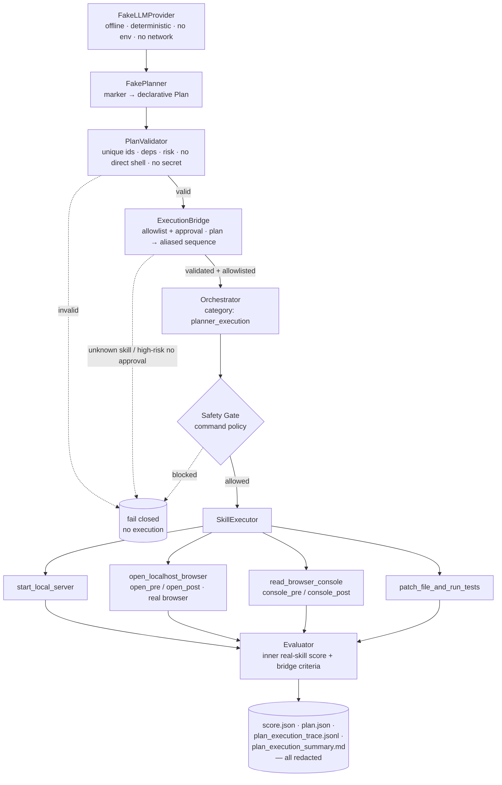

# Architecture diagram — Fake Planner Execution

The Phase 2A chain, from the fake provider to the evaluator. Every hop is
deterministic, allowlisted, and redacted; nothing here calls a real API or runs a
direct shell command.

## Mermaid



## Text fallback (no Mermaid)

```
FakeLLMProvider  (offline, deterministic, no env, no network)
      │
      ▼
FakePlanner      (marker → declarative Plan)
      │
      ▼
PlanValidator    (unique ids · deps · risk · no direct shell · no secret)
      │  valid ─────────────────────────────► invalid ──► FAIL CLOSED (no execution)
      ▼
ExecutionBridge  (allowlist + approval policy · plan → aliased skill sequence)
      │  ok ───────────────────────────────► unknown skill / high-risk-no-approval ──► FAIL CLOSED
      ▼
Orchestrator     (category: planner_execution)
      │
      ▼
Safety Gate      (command policy on every emitted command) ──► blocked ──► FAIL CLOSED
      │ allowed
      ▼
SkillExecutor
      ├─ start_local_server
      ├─ open_localhost_browser   (open_pre / open_post — real browser)
      ├─ read_browser_console     (console_pre / console_post)
      └─ patch_file_and_run_tests
      │
      ▼
Evaluator        (inner real-skill score + bridge criteria)
      │
      ▼
Redacted artifacts:  score.json · plan.json · plan_execution_trace.jsonl ·
                     plan_execution_summary.md
```

## Notes

- **FakeLLMProvider / FakePlanner** are the only "LLM" surface — fake, offline,
  deterministic. No real provider is implemented; the loader fails closed.
- **PlanValidator → ExecutionBridge** is the trust boundary: only a *validated*
  plan with *allowlisted* skills and satisfied *approval* policy reaches the
  orchestrator. Everything else fails closed.
- **No autonomous replan:** the path is one-way. On failure the chain stops and
  reports — it does not loop back to the planner. Auto-repair is a separate,
  not-yet-started phase.
- The **Safety Gate** is unchanged and still checks every command the skills emit.
