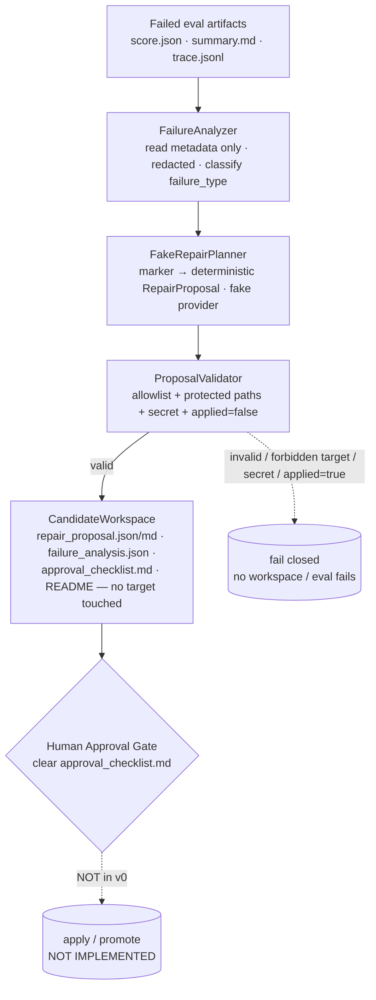

# Architecture diagram — Repair Proposal (v0, proposal-only)

The Phase 3 chain, from a failed eval's artifacts to a human approval gate. Every
hop is deterministic, allowlisted, and redacted; nothing here calls a real API,
runs a shell command, or applies a change.

## Mermaid



## Text fallback (no Mermaid)

```
Failed eval artifacts   (score.json · summary.md · trace.jsonl)
      │
      ▼
FailureAnalyzer         (read metadata ONLY · redacted · no .env/secret · classify)
      │
      ▼
FakeRepairPlanner       (marker → deterministic RepairProposal · fake, offline)
      │
      ▼
ProposalValidator       (allowlist action types · protected-path block · secret · applied=false)
      │  valid ───────────────────► invalid / forbidden / secret / applied=true ──► FAIL CLOSED
      ▼
CandidateWorkspace      (write proposal + failure_analysis + approval_checklist + README)
      │                  *** no target file is modified ***
      ▼
Human Approval Gate     (a human clears approval_checklist.md)         [NOT in v0]
      │
      ▼
apply / promote                                                        [NOT IMPLEMENTED]
```

## Notes

- **FailureAnalyzer** is read-only and reads just three artifact names; it never
  touches `.env`, a password file, or any secret, and redacts what it keeps.
- **FakeRepairPlanner** is the only "LLM" surface — fake, offline, deterministic.
  No real provider is implemented.
- **ProposalValidator** is the trust boundary: a proposal that targets stable /
  safety_gate / promotion_policy, uses a shell/delete action, carries a secret, or
  claims `applied=true` is rejected. Nothing past it is ever applied.
- **The chain stops at the human approval gate.** There is no apply step and no
  `scripts/repair_apply.py`. Approved patch application is a separate,
  not-yet-started phase.
