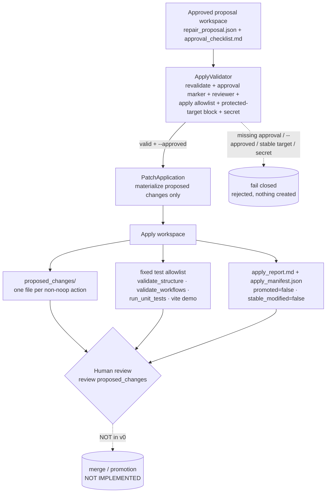

# Architecture diagram — Approved Patch Application (v0, workspace-only)

The Phase 4 chain, from an approved proposal workspace to a human review gate.
Every hop is approval-gated, allowlisted, and redacted; nothing here modifies a
real target file, runs a raw shell, merges, or promotes.

## Mermaid



## Text fallback (no Mermaid)

```
Approved proposal workspace   (repair_proposal.json + approval_checklist.md)
      │
      ▼
ApplyValidator    (revalidate proposal + approval marker + named reviewer +
                   apply allowlist + protected-target block + secret)
      │  valid + --approved ─────────► missing approval / --approved / stable target / secret ──► FAIL CLOSED
      ▼
PatchApplication  (materialize PROPOSED changes only — never a real target file)
      │
      ▼
Apply workspace
      ├─ proposed_changes/        (one file per non-noop action)
      ├─ fixed test allowlist     (validate_structure · validate_workflows ·
      │                            run_unit_tests · vite demo — recorded)
      └─ apply_report.md + apply_manifest.json   (promoted=false, stable_modified=false)
      │
      ▼
Human review      (review proposed_changes)
      │
      ▼
merge / promotion                                 [NOT IMPLEMENTED]
```

## Notes

- **ApplyValidator** is the trust boundary: apply happens only with a human
  approval marker + named reviewer + explicit `--approved`, only for allowlisted
  action types, and never against a stable / safety_gate / promotion_policy target.
- **PatchApplication** writes only inside the apply workspace; the live repo
  targets are never written. `apply_manifest.json` records `promoted: false`,
  `stable_modified: false`.
- **The chain stops at human review.** There is no merge step and no promotion.
  Merge + promotion is a separate, not-yet-started phase that must keep a rollback
  and follow the promotion policy.
- Stable skills, the safety gate, and the promotion policy are untouched throughout.
