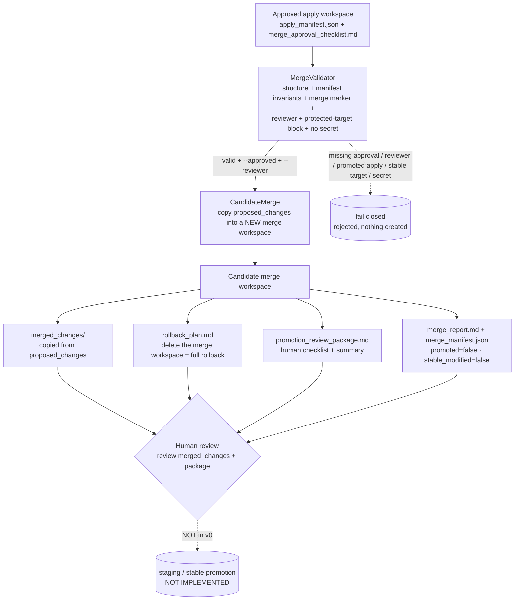

# Architecture diagram — Candidate Merge (v0, candidate-workspace-only)

The Phase 5 chain, from an approved apply workspace to a human review gate. Every
hop is approval-gated, allowlisted, and redacted; nothing here modifies a real
target file, an active candidate, runs a raw shell, or promotes.

## Mermaid



## Text fallback (no Mermaid)

```
Approved apply workspace   (apply_manifest.json + merge_approval_checklist.md)
      │
      ▼
MergeValidator    (structure + manifest invariants [workspace_only / not promoted /
                   not stable_modified] + merge marker + named reviewer +
                   protected-target block + no secret)
      │  valid + --approved + --reviewer ──► missing approval / reviewer / promoted /
      │                                       stable target / secret ──► FAIL CLOSED
      ▼
CandidateMerge    (copy proposed_changes -> a NEW candidate merge workspace;
                   never a real target / active candidate / stable)
      │
      ▼
Candidate merge workspace
      ├─ merged_changes/             (copied from the apply workspace)
      ├─ rollback_plan.md            (delete the workspace = full rollback)
      ├─ promotion_review_package.md (human checklist + summary)
      └─ merge_report.md + merge_manifest.json   (promoted=false, stable_modified=false)
      │
      ▼
Human review      (review merged_changes + promotion review package)
      │
      ▼
staging / stable promotion                       [NOT IMPLEMENTED]
```

## Notes

- **MergeValidator** is the trust boundary: merge happens only with a human
  merge-approval marker + named reviewer + explicit `--approved`/`--reviewer`, only
  when the source apply was workspace-only and not promoted, and never against a
  stable / safety_gate / promotion_policy target.
- **CandidateMerge** writes only inside the candidate merge workspace; the live
  repo, active candidates, and stable are never written. `merge_manifest.json`
  records `merged_to_candidate_workspace=true`, `promoted=false`,
  `stable_modified=false`, `rollback_available=true`.
- **The chain stops at human review.** There is no staging/stable promotion step.
  Promotion is a separate, not-yet-started phase that must verify the rollback and
  follow the promotion policy.
- Stable skills, active candidate runtime, the safety gate, and the promotion policy
  are untouched throughout.
