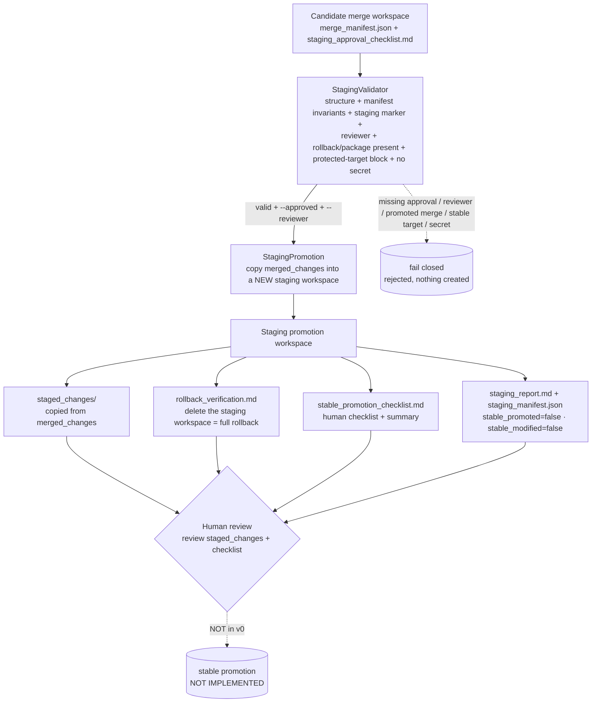

# Architecture diagram — Staging Promotion (v0, staging-workspace-only)

The Phase 6 chain, from a candidate merge workspace to a human review gate. Every
hop is approval-gated, allowlisted, and redacted; nothing here modifies a real
target file, an active candidate, runs a raw shell, or stable-promotes.

## Mermaid



## Text fallback (no Mermaid)

```
Candidate merge workspace   (merge_manifest.json + staging_approval_checklist.md)
      │
      ▼
StagingValidator  (structure + manifest invariants [candidate-workspace-only /
                   not promoted / not stable-modified / rollback_available] +
                   staging marker + named reviewer + rollback/package present +
                   protected-target block + no secret)
      │  valid + --approved + --reviewer ──► missing approval / reviewer / promoted /
      │                                       stable target / secret ──► FAIL CLOSED
      ▼
StagingPromotion  (copy merged_changes -> a NEW staging workspace;
                   never a real target / active candidate / stable)
      │
      ▼
Staging promotion workspace
      ├─ staged_changes/             (copied from the merge workspace)
      ├─ rollback_verification.md    (delete the workspace = full rollback)
      ├─ stable_promotion_checklist.md (human checklist + summary)
      └─ staging_report.md + staging_manifest.json   (stable_promoted=false, stable_modified=false)
      │
      ▼
Human review      (review staged_changes + stable promotion checklist)
      │
      ▼
stable promotion                                 [NOT IMPLEMENTED]
```

## Notes

- **StagingValidator** is the trust boundary: staging happens only with a human
  staging-approval marker + named reviewer + explicit `--approved`/`--reviewer`, only
  when the source merge was candidate-workspace-only and not promoted, and never
  against a stable / safety_gate / promotion_policy target.
- **StagingPromotion** writes only inside the staging workspace; the live repo,
  active candidates, and stable are never written. `staging_manifest.json` records
  `staged=true`, `stable_promoted=false`, `stable_modified=false`,
  `active_candidate_modified=false`, `rollback_verified`.
- **The chain stops at human review.** There is no stable promotion step. Stable
  promotion is a separate, not-yet-started phase that must confirm the verified
  rollback + full regression and follow the promotion policy.
- Stable skills, active candidate runtime, the safety gate, and the promotion policy
  are untouched throughout.
